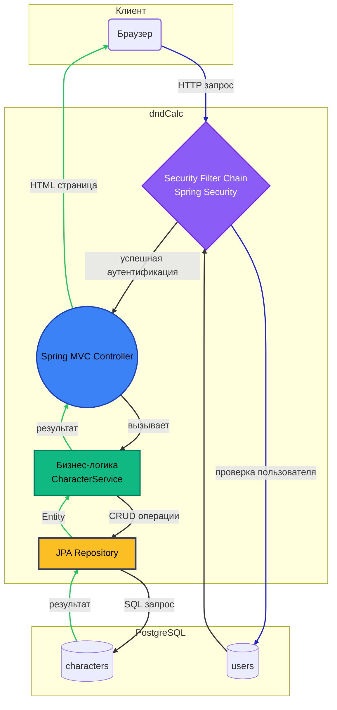

# dndCalc

<!---->
 <!--      -->

<!--  

  -->

Веб-приложение для создания и управления персонажами для игр с механикой типа Dungeons &amp; Dragons
___

```mermaid
graph TB
    subgraph Клиент
        A(Браузер)
    end

    subgraph dndCalc
        F{Security Filter Chain<br/>Spring Security}
        B((Spring MVC Controller))
        C[Бизнес-логика<br/>CharacterService]
        D[JPA Repository]
    end

    subgraph PostgreSQL
        E[(characters)]
        G[(users)]
    end

A -->|HTTP запрос| F
F -->|проверка пользователя| G
G-->| | F
F -->|успешная аутентификация| B
B -->|вызывает| C
C -->|CRUD операции| D
D -->|SQL запрос| E
E -->|результат| D
D -->|Entity| C
C -->|результат| B
B -->|HTML страница| A

style A fill:stroke:#d97706,stroke-width:2px,r:50
style B fill:#3b82f6,stroke:#1e40af,stroke-width:2px,color:#000
style C fill:#10b981,stroke:#047857,stroke-width:2px,color:#000
style D fill:#fbbf24,stroke:#374151,stroke-width:3px,color:#000
style F fill:#8b5cf6,stroke:#6d28d9,stroke-width:2px,color:#fff

linkStyle 0 stroke:#22c,stroke-width:2px
linkStyle 1 stroke:#22c,stroke-width:2px
linkStyle 2 stroke-width:2px
linkStyle 3 stroke-width:2px
linkStyle 4 stroke-width:2px
linkStyle 5 stroke-width:2px
linkStyle 6 stroke-width:2px
linkStyle 7 stroke:#22c55e,stroke-width:2px
linkStyle 8 stroke:#22c55e,stroke-width:2px
linkStyle 9 stroke:#22c55e,stroke-width:2px
linkStyle 10 stroke:#22c55e,stroke-width:2px
```
