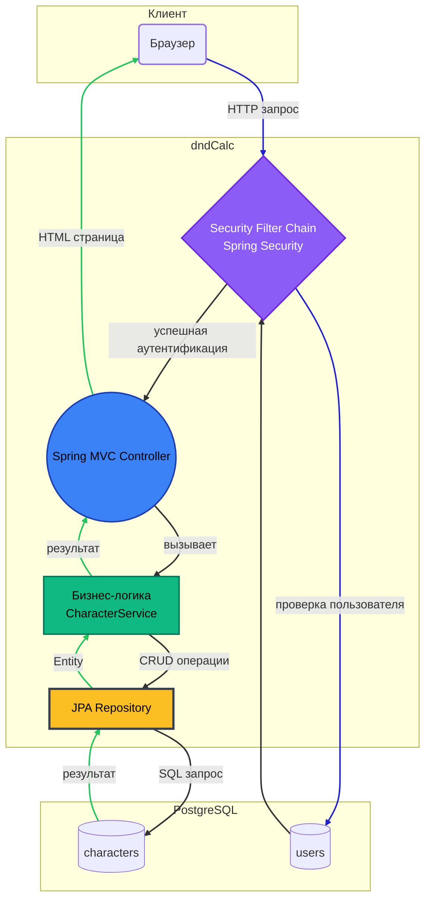

# dndCalc

<!--    -->
<!--    -->   
<!--    -->  
<!--  -->
<!--  -->


<!-- 


  -->

Веб-приложение для создания и управления персонажами для игр с механикой типа Dungeons &amp; Dragons
___


### Основной функционал

- Создание и управление персонажами D&D
- Распределение характеристик
- Сохранение персонажей в базе данных
- Управление инвентарем и экипировкой

### 🚀 Быстрый старт (локальный запуск)

Для запуска требуется **Docker**.

```bash
git clone https://github.com/AABarabanov/dndCalc
cd dndСalc
docker compose up
```
👉 http://localhost:8080

---

<!--
### Технологии
- **Backend**: Java 17, Spring Boot 4
- **Database**: PostgreSQL
- **Build**: Maven
- **Deployment**: Docker, Docker Compose  -->

<!--### Запуск
```bash
# Поднять всё вместе
docker-compose up -d
# Приложение будет доступно на http://localhost:8080
# PostgreSQL будет доступен на localhost:5432
```  -->


